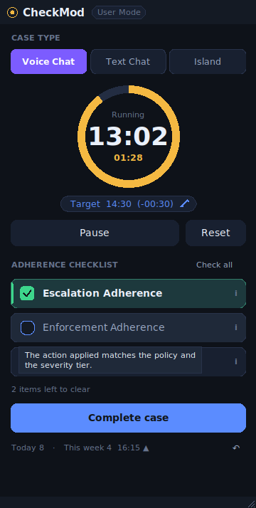
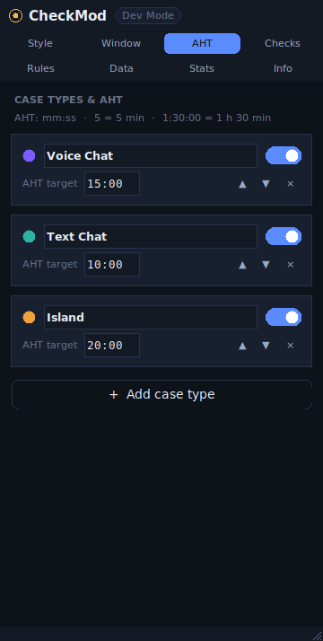
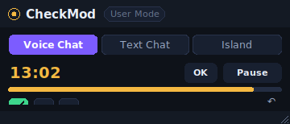
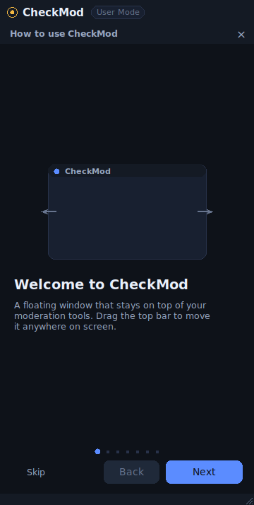
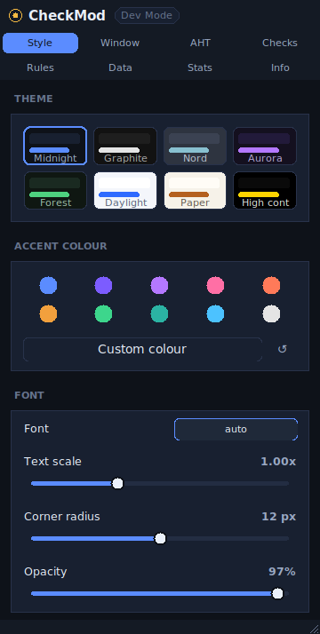
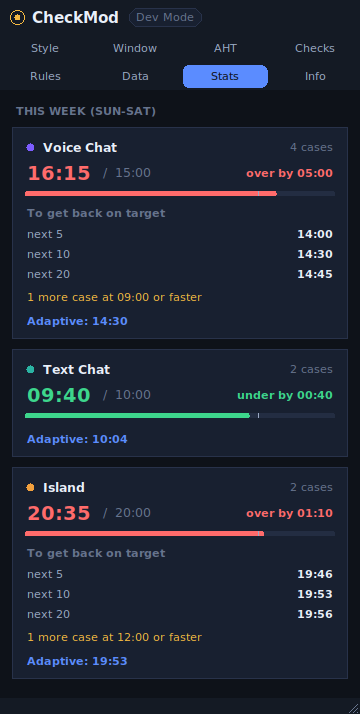
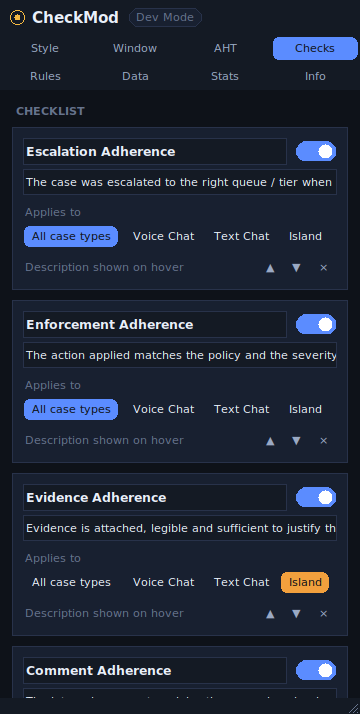
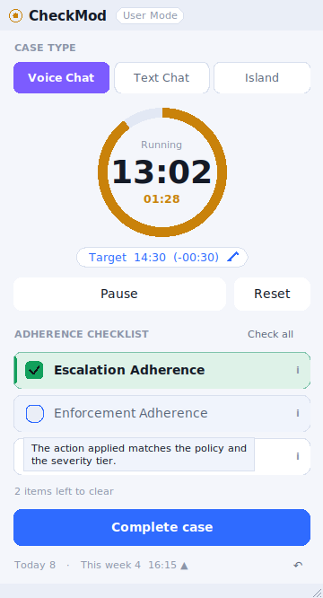
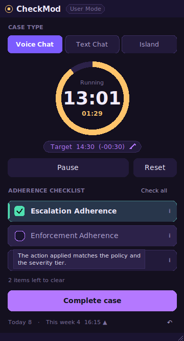

<div align="center">


# CheckMod

**A floating, always-on-top moderation checklist with built-in AHT tracking.**

Portable · offline · no installer · no administrator rights

</div>

---

CheckMod is a small desktop companion for Trust & Safety agents. It sits on
top of your moderation tools, times each case against its Average Handle Time
target, and gives you a four-item adherence checklist to clear before you
close the case.

It is a **single portable executable**. Copy it anywhere — Desktop, a USB
stick, a network share — and double-click. Nothing is installed, no registry
keys are written, no services are registered and **no administrator rights
are ever requested**, so it never needs an IT ticket.

<div align="center">


&nbsp;&nbsp;


<sub><b>User Mode</b> — everything you need during a case &nbsp;·&nbsp; <b>Dev Mode</b> — every AHT target, editable</sub>

</div>

---

## Contents

- [Highlights](#highlights)
- [Quick start](#quick-start)
- [The two modes](#the-two-modes)
- [Screenshots](#screenshots)
- [Keyboard shortcuts](#keyboard-shortcuts)
- [Privacy and security](#privacy-and-security)
- [Building the executable](#building-the-executable)
- [Running from source](#running-from-source)
- [Project layout](#project-layout)
- [Documentation](#documentation)
- [License](#license)

---

## Highlights

| | |
|---|---|
| **Always on top** | The window floats above every other application, so the checklist never disappears behind the moderation queue. One click un-pins it. |
| **AHT per case type** | Voice Chat, Text Chat and Island ship with their own targets. Add, rename, recolour, reorder, disable or delete case types, and edit any target in seconds — from Dev Mode or straight from the timer. |
| **Adherence checklist** | Escalation, Enforcement, Evidence and Comment Adherence, each with a hover description. **Per case type** — Evidence Adherence applies to Island only, so Voice and Text chats show three items. Fully editable: add your own, reword them, change which types they apply to. |
| **Adaptive AHT** | The target tracks the weekly average instead of a static number: run long on a few cases and the next ones ask for slightly less. Spread over a configurable number of cases, clamped at both ends, and switchable off. |
| **Weekly plan** | This week Sunday–Saturday, per case type: count, running average vs target, and how many more cases at what AHT to get back on target. |
| **Undo** | Removes the last logged case and puts it back on the clock so it can be corrected. Mis-clicking Complete skews nothing. |
| **Live AHT gauge** | The ring fills as the case runs, turns amber at a configurable threshold and red once the target is passed. A heads-up alert fires a configurable number of seconds *before* the target, while there is still time to wrap up. |
| **Two modes** | *User Mode* is a deliberately tiny surface for daily work. *Dev Mode* exposes every option, plus statistics. |
| **Deeply customisable** | 8 themes, 10 accent swatches plus any custom colour, opacity, corner radius, font, text scale, layout switches, snapping, thresholds — all live, no restart. |
| **Compact layout** | Collapses to a single strip that tucks into a screen corner next to your queue. |
| **Local statistics** | This week per case type with its recovery plan, plus cases handled, average AHT, percentage within target, percentage with a clean checklist, and which adherence item you miss most. Exportable to CSV. |
| **Built-in tutorial** | A seven-step walkthrough on first run, reachable any time from the **?** button or `F1`. |
| **Privacy first** | Zero network code. Zero telemetry. No personal data and no case identifiers are ever stored. One button erases everything. |
| **Zero dependencies** | Pure Python standard library. The whole app is auditable in an afternoon. |

---

## Quick start

### 1. Get the app

From the [Releases](../../releases) page:

| Download | Use it when |
|---|---|
| **`CheckMod-folder.zip`** | **Recommended on a managed work machine.** Unzip anywhere, run the `CheckMod.exe` inside. Extracts nothing at runtime, so it gives heuristic antivirus far less to object to, and starts instantly. |
| `CheckMod.exe` | You want a single file and your machine is not locked down. |
| `SHA256SUMS.txt` | Your IT team wants to allow-list the exact build. |

Or build it yourself in one command — see [Building the executable](#building-the-executable).

### 2. Put it somewhere you own

Your Desktop, `Documents`, or a USB stick. Anywhere you can already write
files works; you do **not** need `C:\Program Files` and you do **not** need
an administrator.

### 3. Double-click it

The tutorial opens on the first run. That's the whole setup.

> **First launch of the single-file build takes a second or two** while it
> unpacks itself into your temporary folder. The folder distribution starts
> immediately.

> **Windows may show a SmartScreen prompt** for any new unsigned executable —
> it is a reputation check, not a malware verdict. Click *More info → Run
> anyway*. [docs/IT-APPROVAL.md](docs/IT-APPROVAL.md) is a one-pager for
> whoever approves software on your machines.

### 4. Use it

1. Click a **case type** — the timer starts automatically.
2. Work the case. Watch the ring.
3. Tick each **adherence item** as you verify it.
4. Hit **Complete case** — the record is logged locally, the checklist
   resets, and you're ready for the next one.

---

## The two modes

### User Mode

The default. Case type, timer, checklist, one button. Nothing to configure,
nothing to get wrong, nothing that needs training beyond the built-in
tutorial.

### Dev Mode

Click **DEV** in the title bar (or press `Ctrl+D`). Eight sections:

| Section | What lives there |
|---|---|
| **Style** | Theme presets, accent colour, custom colour picker, font, text scale, corner radius, opacity, layout switches |
| **Window** | Always on top, custom title bar, edge snapping and its distance, remembered position, re-centre, compact mode |
| **AHT** | Case types: name, colour, AHT target, enable/disable, reorder, delete, add |
| **Checks** | Checklist items: label, hover description, which case types they apply to, enable/disable, reorder, delete, add |
| **Rules** | Auto-start, reset confirmation, "require a full checklist", paused-time accounting, amber threshold, pre-target heads-up, over-target alert and sound, adaptive-AHT tuning and the week boundary |
| **Data** | History on/off, retention, storage location, portable mode, CSV export, settings import/export, erase everything |
| **Stats** | This week (Sun–Sat) per case type with the recovery plan, plus today, all time, and your most-missed adherence items |
| **Info** | Version, keyboard shortcuts, the privacy statement, and the tutorial |

Every change applies immediately and is saved to disk right away.

---

## Screenshots

<div align="center">

| User Mode | Compact layout | Tutorial |
|:---:|:---:|:---:|
|  |  |  |

| Themes & accents | AHT targets | Weekly plan |
|:---:|:---:|:---:|
|  |  |  |

| Per-case checklists | Daylight theme | Aurora theme |
|:---:|:---:|:---:|
|  |  |  |

</div>

---

## Keyboard shortcuts

All shortcuts are bound to the CheckMod window only. The app installs **no
global keyboard hook**, which is exactly why it needs no elevated
permissions and will not trip endpoint-security tooling.

| Keys | Action |
|---|---|
| `Space` | Start / pause the timer |
| `1` … `9` | Toggle the *n*-th checklist item |
| `Alt+1` … `Alt+9` | Select the *n*-th case type |
| `Ctrl+Enter` | Complete the case |
| `Ctrl+R` | Reset the case |
| `Ctrl+Z` | Undo the last logged case |
| `Ctrl+D` | Toggle Dev Mode |
| `Ctrl+T` | Toggle always-on-top |
| `Ctrl+M` | Toggle the compact layout |
| `F1` | Open the tutorial |
| `Ctrl+Q` | Quit |

Double-clicking the title bar also toggles the compact layout, and the grip
in the bottom-right corner resizes the window.

---

## Privacy and security

CheckMod was written for a corporate environment, so the privacy properties
are structural rather than promised:

- **No network code at all.** The application imports no networking module.
  The build even *excludes* `socket`, `ssl`, `http` and `urllib.request` from
  the executable, so the capability is not merely unused — it is not present.
- **No telemetry, no analytics, no crash reporting, no auto-update.**
- **No personal data.** A completed-case record contains the case *type*, the
  duration, the target and which adherence items were cleared. There is no
  field for a case ID, a user name, a subject, or free text — by design.
- **Plain text, on your machine.** Settings are JSON, history is JSON Lines.
  Open them in Notepad. Delete them whenever you like.
- **One-click erase.** *Dev Mode → Data → Erase all data*.
- **No installation, no elevation.** Nothing is written outside the folder
  you chose or your own user profile.

The full statement, including what a security reviewer should check and how
to verify each claim, is in **[docs/PRIVACY.md](docs/PRIVACY.md)**.

---

## Building the executable

You need Python 3.9+ on the machine. Nothing else, and no admin rights: the
build creates its own virtual environment inside the repository folder.

**Windows**

```powershell
git clone https://github.com/JustRab/CheckModApp.git
cd CheckModApp
powershell -ExecutionPolicy Bypass -File packaging\build_windows.ps1
```

or simply double-click `packaging\build_windows.bat`.

The result is `dist\CheckMod.exe` — roughly 12 MB, self-contained, portable.

**Linux / macOS**

```bash
./packaging/build_linux.sh      # produces dist/CheckMod
```

CI also builds the Windows executable on every tag; see
**[docs/BUILD.md](docs/BUILD.md)** for the workflow, code-signing notes and
antivirus troubleshooting.

---

## Running from source

No build step is required to try it out.

```bash
git clone https://github.com/JustRab/CheckModApp.git
cd CheckModApp
python -m checkmod
```

On Windows you can also just double-click **`CheckMod.pyw`**, which starts the
app with `pythonw.exe` and therefore without a console window.

On Debian/Ubuntu, Tk is a separate package: `sudo apt install python3-tk`.

**Tests**

```bash
python -m pip install pytest
python -m pytest tests/ -v          # add xvfb-run -a on a headless Linux box
```

91 tests cover the timer maths, settings validation and self-healing, the
history log and its statistics, colour contrast in every theme, and a full
interface smoke pass that builds every view and every theme.

---

## Project layout

```
CheckModApp/
├── checkmod/                 The application (standard library only)
│   ├── app.py                Window management, state wiring, tick loop
│   ├── config.py             Settings: defaults, validation, persistence
│   ├── session.py            Stopwatch + checklist state machine (no UI)
│   ├── history.py            Local JSON Lines log and its statistics
│   ├── theme.py              Colour tokens, presets and colour maths
│   ├── paths.py              Portable vs. per-user storage resolution
│   ├── i18n.py               String table
│   └── ui/                   Canvas-drawn widget toolkit and the views
│       ├── primitives.py     Buttons, sliders, switches, ring, scrolling
│       ├── titlebar.py       Custom window chrome
│       ├── checkrow.py       Adherence checklist rows
│       ├── user_view.py      User Mode
│       ├── dev_view.py       Dev Mode
│       ├── tutorial.py       Seven-step walkthrough
│       ├── dialogs.py        Themed modals
│       └── fonts.py          Type scale and font resolution
├── packaging/                PyInstaller spec, build scripts, version info
├── tools/make_icon.py        Generates the icon from code (no image editor)
├── tests/                    Unit and interface tests
├── docs/                     Tutorial, privacy, customisation, build, FAQ
└── assets/                   Generated icon
```

---

## Documentation

| Document | What it covers |
|---|---|
| **[docs/TUTORIAL.md](docs/TUTORIAL.md)** | Step-by-step usage guide, the same content as the in-app walkthrough plus the details it leaves out |
| **[docs/CUSTOMIZATION.md](docs/CUSTOMIZATION.md)** | Every setting, the full `settings.json` reference, theming, and how to roll out a team-wide preset |
| **[docs/PRIVACY.md](docs/PRIVACY.md)** | The privacy and security statement, written for an IT or security reviewer |
| **[docs/IT-APPROVAL.md](docs/IT-APPROVAL.md)** | One page to hand to IT: what it touches, why an antivirus warning may appear, and how to verify every claim |
| **[docs/BUILD.md](docs/BUILD.md)** | Building, CI, code signing, antivirus false positives |
| **[docs/ARCHITECTURE.md](docs/ARCHITECTURE.md)** | Module map, data flow, and how to extend the app |
| **[docs/FAQ.md](docs/FAQ.md)** | Common questions and troubleshooting |

---

## License

MIT — see [LICENSE](LICENSE).
